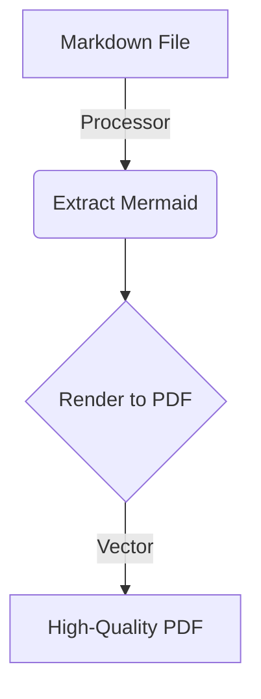

# md-2-pdf

[](https://www.npmjs.com/package/@joaodotwork/md-2-pdf)
[](https://opensource.org/licenses/MIT)

A powerful CLI tool to convert Markdown files to PDF with built-in **Mermaid diagram support**. It bridges the gap between GitHub-flavored documentation and professional PDF exports.

## Why md-2-pdf?

Most markdown-to-pdf converters struggle with diagrams or produce poorly formatted documents. `md-2-pdf` is designed to:
- **Preserve Vector Quality:** Renders Mermaid diagrams as PDF vectors (not bitmaps) for lossless scaling.
- **Support GFM Conventions:** Handles lists interrupting paragraphs, task lists, and other GitHub Flavored Markdown features.
- **Professional Typography:** Uses `xelatex` by default for high-quality typesetting with smart page breaking.

## Key Features

- **Mermaid Diagrams:** Automatically detects ````mermaid` blocks and renders them as vector graphics.
- **Smart Formatting:**
  - Standardized 11pt font and optimized line spacing.
  - Interactive, blue clickable links.
  - Automatic widow/orphan protection (keeps headers with content).
  - Customizable margins and geometry.
- **Multi-Engine Support:** Automatically detects and uses the best available PDF engine (`xelatex`, `pdflatex`, `weasyprint`, or `wkhtmltopdf`).
- **Batch Processing:** Convert single files or entire directories with one command.

## Installation

### Prerequisites

1.  **Node.js & npm** (Required for Mermaid rendering)
2.  **Python 3** (Required for the core logic)
3.  **Pandoc** (The engine behind the conversion)
4.  **PDF Engine** (One of the following):
    *   **Recommended:** `xelatex` (Install via [MacTeX](https://tug.org/mactex/) on macOS or `texlive-full` on Linux)
    *   *Alternative:* `weasyprint` (`pip install weasyprint`)

### Install via npm

```bash
npm install -g @joaodotwork/md-2-pdf
```

*Or use `pnpm` / `yarn`:*
```bash
pnpm add -g @joaodotwork/md-2-pdf
```

## Usage

### Single File Conversion

```bash
md-2-pdf manual.md
```
*Creates `manual.pdf` in the same directory.*

### Batch Processing

Convert all markdown files in a directory:

```bash
md-2-pdf ./documentation
```

### Advanced Options

```bash
# Specify a custom output name
md-2-pdf proposal.md -o Final_Proposal.pdf

# Check if all dependencies are correctly installed
md-2-pdf --check-only
```

## Mermaid Support

Simply use standard Mermaid syntax in your markdown:



The tool will extract these blocks, render them using `mermaid-cli`, and embed them back into the final document seamlessly.

## Troubleshooting

If you encounter issues with PDF generation, ensure `pandoc` and a LaTeX engine (like `xelatex`) are in your PATH. You can verify this by running:

```bash
md-2-pdf --check-only
```

## License

MIT © [Joao Doria de Souza](https://github.com/joaodotwork)
