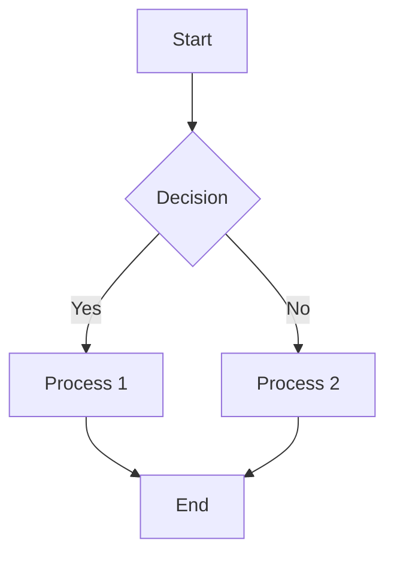

# Markdown to PDF Converter with Mermaid Support

A Python utility to convert Markdown files to PDF while properly rendering Mermaid diagrams.

## Features

- Converts Markdown files to PDF
- Properly renders Mermaid diagrams as images in the PDF
- Processes individual files or entire directories
- Customizable output and temporary directories

## Requirements

- Python 3.6+
- Node.js and npm (for Mermaid CLI)
- Pandoc (for Markdown to PDF conversion)
- LaTeX (XeLaTeX for PDF generation)

## Installation

1. Ensure you have Python 3.6+ installed
2. Install Node.js and npm
3. Install Pandoc: https://pandoc.org/installing.html
4. Install a LaTeX distribution like TeX Live or MiKTeX
5. Clone this repository or download the script

The script will automatically install the Mermaid CLI (@mermaid-js/mermaid-cli) if needed.

## Usage

### Basic Usage

Convert a single Markdown file to PDF:

```bash
python md_to_pdf.py path/to/file.md
```

Convert all Markdown files in a directory:

```bash
python md_to_pdf.py path/to/directory
```

### Advanced Options

Specify output file or directory:

```bash
python md_to_pdf.py path/to/input.md -o path/to/output.pdf
python md_to_pdf.py path/to/input_dir -o path/to/output_dir
```

Specify custom temporary directory:

```bash
python md_to_pdf.py path/to/input.md -t path/to/temp_dir
```

Check if all dependencies are installed:

```bash
python md_to_pdf.py --check-only
```

## How It Works

1. The script reads the Markdown file and extracts Mermaid diagram code blocks
2. For each Mermaid diagram, it:
   - Saves the diagram code to a temporary file
   - Uses Mermaid CLI to render the diagram as an image
   - Replaces the Mermaid code block with an image reference
3. The modified Markdown with image references is saved to a temporary file
4. Pandoc converts the modified Markdown to PDF using XeLaTeX

## Example

Input Markdown:

````markdown
# Sample Document

Here's a diagram:


````

This will be converted to a PDF with the diagram properly rendered.