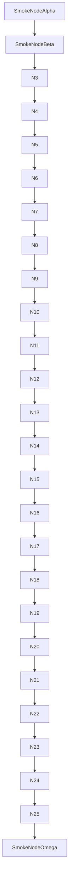

# Smoke test

Plain Latin paragraph with an em dash — and “curly quotes”.

## 日本語の見出し

プランタス・プレス is written ぷらんたす in hiragana. 植物 means plants.


```mermaid
flowchart TD
    SmokeNodeAlpha --> SmokeNodeBeta
    SmokeNodeBeta --> N3
    N3 --> N4
    N4 --> N5
    N5 --> N6
    N6 --> N7
    N7 --> N8
    N8 --> N9
    N9 --> N10
    N10 --> N11
    N11 --> N12
    N12 --> N13
    N13 --> N14
    N14 --> N15
    N15 --> N16
    N16 --> N17
    N17 --> N18
    N18 --> N19
    N19 --> N20
    N20 --> N21
    N21 --> N22
    N22 --> N23
    N23 --> N24
    N24 --> N25
    N25 --> SmokeNodeOmega
```

```
├── コード 植物
```
